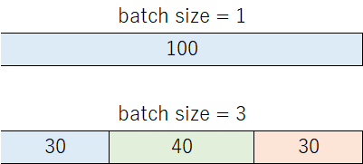

# ESPnet3 Collect Stats Overview

`collect_stats` still serves the same two broad purposes as in ESPnet2:

1. produce shape information for batching
2. produce statistics for normalization such as GlobalMVN



## 1. Feature length collection

Shape files produced under `stats_dir/train` and `stats_dir/valid` are commonly
used by ESPnet iterator-based batching.

Precomputing feature lengths lets the iterator adjust batches based on sequence
size, which is one of the main ways ESPnet avoids out-of-memory errors.

## 2. Global mean and variance

When the model uses normalization that needs dataset-level stats, `collect_stats`
writes files such as:

```text
${stats_dir}/train/feats_stats.npz
```

Task-backed models usually point to these through:

```yaml
model:
  normalize: global_mvn
  normalize_conf:
    stats_file: ${stats_dir}/train/feats_stats.npz
```

If a custom model wants to instantiate normalization directly through Hydra, a
common pattern is:

```yaml
normalize:
  _target_: espnet2.layers.global_mvn.GlobalMVN
  stats_file: ${stats_dir}/train/feats_stats.npz
```

That is the same conceptual role as in ESPnet2: compute a dataset-level summary
once, then reuse it during the actual training stage.

The difference in ESPnet3 is mainly the surrounding config and stage wiring, not
the purpose of the files themselves.

If a user already has compatible statistics from elsewhere, the model can also
point to that file directly. The important point is that ESPnet3 still treats
`collect_stats` as the standard place to create these files.

## 3. Advanced use cases: GPU-based stats collection

If `parallel` is configured in `training.yaml`, the stage can reuse ESPnet3's
parallel execution helpers for heavier feature extraction workloads.

Example:

```yaml
parallel:
  env: slurm
  n_workers: 8
  options:
    queue: gpu
    cores: 8
    processes: 1
    memory: 16GB
    walltime: 30:00
    job_extra_directives:
      - "--gres=gpu:1"
```

## Run

```bash
python run.py --stages collect_stats --training_config conf/training.yaml
```

In summary, the stage still creates the same core outputs:

```text
${stats_dir}/train/feats_stats.npz
${stats_dir}/train/feats_shape
${stats_dir}/train/stats_keys
```
